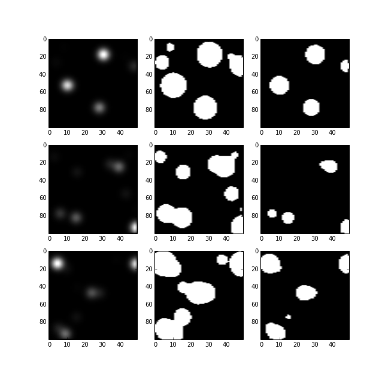

## Look Elsewhere Effect in 2-d

Kyle Cranmer, Nov 19, 2015

Based on
*Estimating the significance of a signal in a multi-dimensional search* by  Ofer Vitells and Eilam Gross http://arxiv.org/pdf/1105.4355v1.pdf

**Note**: You can run the notebook from your browser right now by gong to [everware](https://everware.rep.school.yandex.net/) and paste the URL to this repository. 

## Usage:

```python
import lee2d
```

You start with several 2d numpy arrays that represent the 
-2 log likleihood ratio scan over your two parameters.
It's up to you to threshold on that make 2d numpy arrays at two 
different levels $u_1$ and $u_2$ giving new numpy
arrays with values 0. or 1. 

```python
	scan = np.array((nx, ny))

    #get excursion sets above those two levels
    exc1 = (scan>u1) + 0. #add 0. to convert from bool to double
    exc2 = (scan>u2) + 0.
```

For each of these scans you calculate the Euler characteristic 
using this function in `lee2d.py`

```python
def calculate_euler_characteristic(a):
   """Calculate the Euler characteristic for level set a"""
```

after calculating the expected (mean) value of the Euler characteristics
for those two different levels, you can correct the local siginficance with
this function in `lee2d.py`

```python
def do_LEE_correction(max_local_sig, u1, u2, exp_phi_1, exp_phi_2):
   """
   Return the global p-value for an observed local significance 
   after correcting for the look-elsewhere effect
   given expected Euler characteristic exp_phi_1 above level u1
   and exp_phi_2 above level u2
   """
```


## Background

This is for the special case of a likelihood function of the form 
$L(\mu, \nu_1, \nu_2)$ where $\mu$ is a single parameter of interest and
$\nu_1,\nu_2$ are two nuisance parameters that are not identified under the null.
For example, $\mu$ is the signal strength of a new particle and $\nu_1,\nu_2$ are the
unknown mass and width of the new particle. Under the null hypothesis, those parameters 
don't mean anything... aka they "are not identified under the null" in the statistics jargon.
This introduces a 2-d look elsewhere effect.

The LEE correction in this case is based on 

\begin{equation}
E[ \phi(A_u) ] = P(\chi^2_1 > u) + e^{-u/2} (N_1 + \sqrt{u} N_2) \,
\end{equation}
where 
   * $A_u$ is the 'excursion set above level $u$ (eg. the set of parameter points in $(\nu_1,\nu_2)$ that have a -2 log-likelihood ratio greater than $u$ )
   * $\phi(A_u)$ is the Euler characteristic of the excursion set
   * $E[ \phi(A_u) ]$ is the expectation of the Euler characteristic of those excursion sets under the null
   * $P(\chi^2_1 > u)$ is the standard chi-square probability 
   * and $N_1$ and $N_2$ are two coefficients that characterize the chi-square random field.
   
### structure of the notebook

The notebook is broken into two parts.
  * calculation of $N_1$ and $N_2$ based on $E[ \phi(A_u) ]$ at two different levels $u_1$ and $u_2$
  * calculation of LEE-corrected 'global p-value' given $N_1,N_2$
  * some code to calculate $\phi(A_u)$ using convolutional filters
  * Normal usage based on reading a ROOT file with several likleihood scans

### Image of example 2-d likelihood scans
  

